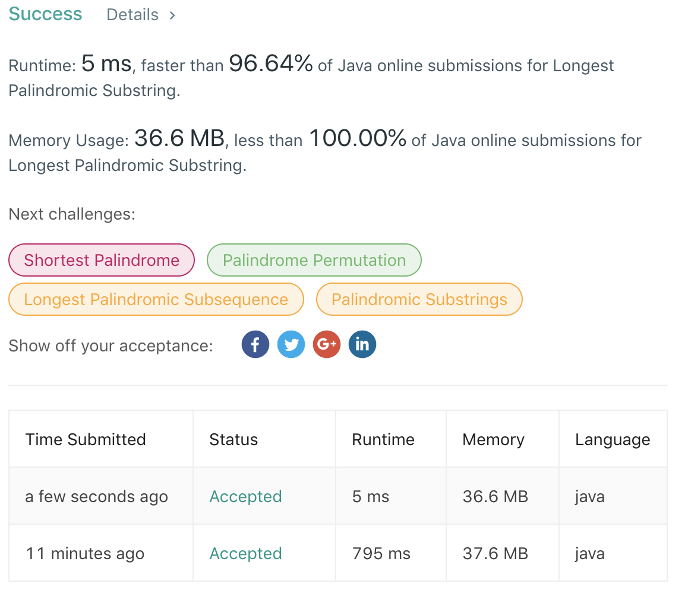

# [Leetcode 5. Longest Palindromic Substring]()

## 题目

Given a string **s**, find the longest palindromic substring in **s**. You may assume that maximum length of **s** is 1000.

**Example 1:**
```
Input: "babad"
Output: "bab"
Note: "aba" is also a valid answer.
```
**Example 2:**
```
Input: "cbbd"
Output: "bb"
```

## 思路

这道题目一定程度上拓展了Leetcode 3的思想，我们也是需要通过某种策略找到input string中满足条件的substring. 不过这里需要我们找到palindromic string. 回文让这个问题变得更复杂有如下两个原因：
1. 无法从string的一端开始遍历以判断其是否为回文
2. 基于1，如果我们想从substring两端开始向中间靠拢，我们却无从知晓两端所处的位置

如果我们可以解决以上两个问题，判断最长substring仅需多加一个global maxlength即可。我们其实可以受到启发，既然不能从substring的两端开始，我们可以从substring的中点开始，逐渐往两边扩展。举个例子，a是回文，如果a的左右两头字母都为b，则bab也一定是回文。

那么怎样选取中点才能高效地将所有panlindromic substring找出来呢？一个直观的想法可能是将每个字母都当做中点，但这样我们只考虑了长度为奇数的palindromic string。为了将偶数长度的也包括在内，我们需要也将每两个字母“之间”当做中点。因此，我们循环每个字母时，既要将它当做中点，也要将它和它下一位字母两个一起当做中点，来找到所有的回文。最终，我们得到如下解答。

## 解答
```java
class Solution {
    
    int minI = 0;
    int maxJ = 0;
    int maxLen = 0;
    
    public String longestPalindrome(String s) {
        if (s == null || s.length() < 1) return "";
        int i = 0, j = 0;
        // iterate through 2n + 1 positions to expand from center to get panlindrome
        while (i < s.length() && j < s.length()) {
            expand(s, i, j++);
            expand(s, i++, j);          
        }
        return s.substring(minI, maxJ);
    }
    
    // Expand from center to construct panlindrome
    private void expand(String s, int i, int j) {
        while (i >= 0 && j < s.length() && s.charAt(i) == s.charAt(j)) {
            i--;
            j++;
        }
        if (j - i + 1 > maxLen) {
            maxLen = j - i + 1;
            minI = i + 1;
            maxJ = j;
        }
    }
}
```
解答中，我们注意到expand方法只会依据substring长度来更新global的最长回文开头、结尾的位置，而不是直接返回回文String。这样做有一个好处是极大优化了算法运行时间，让其不必在过程中产生无用的substring object. 如下图所示，runtime得到了极大的提升：




## Complexity Analysis

- **Time Complexity:** O(n^2). 我们需要遍历2n - 1个中点位置，而对每个中点位置我们又需要O(n)的时间找到最长的palindrome.
- **Space Complexity:** O(1). 我们没有使用额外的空间。

## 总结

这道题目也是双指针的巧妙运用。在这里我们使用了由中间向两边扩展指针，之前在第三题中我们使用了相互追逐的快慢指针。我们需要合理根据题目意思调整双指针的运行方向和判断规则。