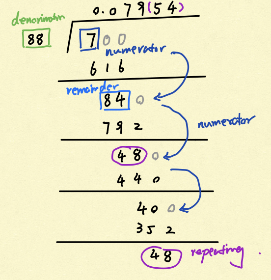

# [Leetcode 166. Fraction to Recurring Decimal](https://leetcode.com/problems/fraction-to-recurring-decimal/)

## 题目

Given two integers representing the numerator and denominator of a fraction, return the fraction in string format.

If the fractional part is repeating, enclose the repeating part in parentheses.

**Example 1:**
```
Input: numerator = 1, denominator = 2
Output: "0.5"
```
**Example 2:**
```
Input: numerator = 2, denominator = 1
Output: "2"
```
**Example 3:**
```
Input: numerator = 2, denominator = 3
Output: "0.(6)"
```

## 思路

为了实现整数的除法，我们首先回忆数学中除法运算的过程。如下：



我们注意到，当denominator < numerator时，我们需要为numerator借位运算（往numerator后加0）；整数除法numerator / denominator所得为结果的每个digit，remainder成为下一次除法的numerator，直到remainder为0，或者有repeating pattern出现（remainder为之前出现过的denominator）。

我们可以用代码实现这个过程。首先用正常的division和modulus运算求出结果的整数部分（如果没有整数部分则为"0."占位），再用循环重复以上数学过程，用整数除法算出每位结果数字，用余数*10作为下一次运算的被除数。为了在repeating pattern周围加上括号，我们需要借助HashMap来记录每个remainder所对应的index，即{remainder: index of corresponding result digit}. 

但是这道题目还需要我们考虑非常多的edge case。如下
1. denominator和numerator其一为负数  --> 需要提前判断结果的符号
2. 除法过程出现integer overflow      --> 需要用long型而非int

最终，我们得到如下解答。

## 解答
```java
class Solution {
    public String fractionToDecimal(int numerator, int denominator) {
        
        if (numerator == 0) return "0";
        StringBuilder sb = new StringBuilder();
        
        // positive and negative cases
        if ( (numerator > 0 && denominator < 0) || (numerator < 0) && (denominator > 0) )
            sb.append("-");
        
        // handle overflow
        long num = Math.abs((long) numerator);
        long den = Math.abs((long) denominator);
        
        // integer 
        res.append(num / den);
        num = den % num;
        
        if (num == 0) return res.toString(); // divisible
        
        // fraction
        res.append(".")
        HashMap<Long, Integer> map = new HashMap<Long, Integer>(); // <key, value> = <remainder, index>
        map.put(num, res.length());
        while (num > 0) {
            num *= 10;
            res.append(num / den);
            num %= den;
            if (map.containsKey(num)) {
                res.insert(map.get(num), "(");
                res.append(")");
                break;
            }
            else {
                map.put(num, res.length());
            }
        }
        return res.toString();
    }
}
```
## Complexity Analysis

- **Time Complexity:** O(numerator). 每次除法之后余数都一定比numerator小，成为新的numerator。最坏情况下需要循环O(numerator)次，直到余数为0或余数出现重复。

- **Space Complexity:** O(length of result). 我们需要额外的HashMap来储存结果数字的每一个digit。

## 拓展

如果我们的input不是整数，而是有限不循环小数，我们可以用类似的方法实现除法吗？

## 总结

这道题目需要我们灵活地将数学方法转化为可行的算法，并详尽包括所有的edge cases。建议采用Test Driven Development的思想，先尽可能的想出多种Test Case，再实现算法，以通过所有的Test Case。

## Reference

- [dechen0215's solution](https://leetcode.com/problems/fraction-to-recurring-decimal/discuss/51106/My-clean-Java-solution)